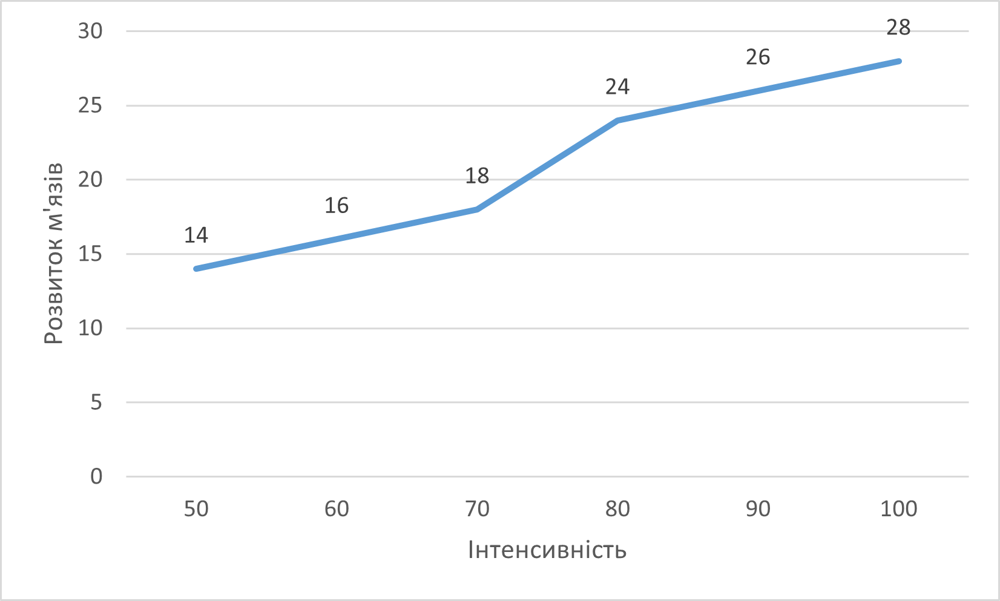
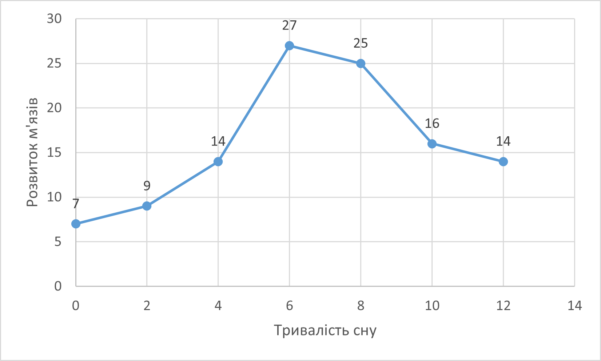
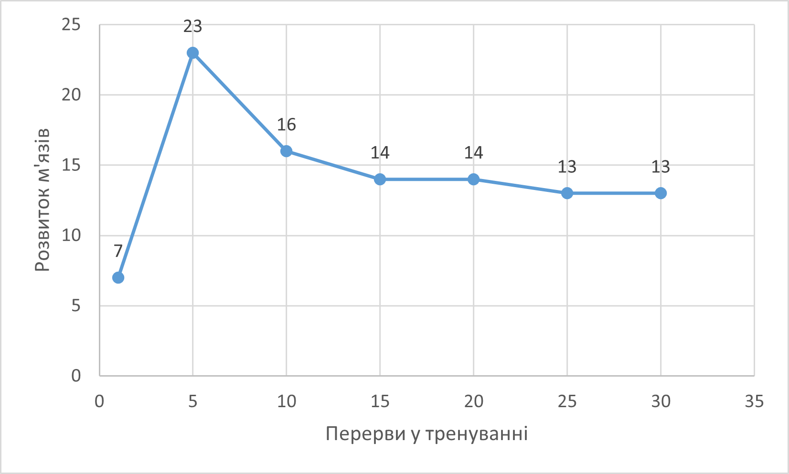

## Комп'ютерні системи імітаційного моделювання
## СПм-22-6, **Юрченко Тарас Андрійович**
### Лабораторна робота №**1**. Опис імітаційних моделей та проведення обчислювальних експериментів

 

### Варіант 12, модель у середовищі NetLogo:
[Muscle Development](http://www.netlogoweb.org/launch#http://www.netlogoweb.org/assets/modelslib/Sample%20Models/Biology/Muscle%20Development.nlogo)

 

### Вербальний опис моделі:
Це фізіологічна модель вправ. Він призначений для того, щоб допомогти вам зрозуміти фактори, що беруть участь у створенні відповідного гормонального балансу для розвитку м’язів під час підняття ваги. Ці фактори включають:

Частота: щоб побачити приріст м’язової маси, необхідно правильно контролювати частоту підняття тягарів. Якщо ви будете піднімати надто часто, у вас не буде часу на відновлення, а потім і на відновлення сильніших м’язів. Якщо вам не вдається підніматися досить часто, не буде достатньо стимулів, щоб викликати довгострокове збільшення м’язів.

Сон: організм більшу частину часу відновлюється під час сну. Якщо ви не висипаєтеся, у вас не буде достатньо можливостей для відновлення, тому вам буде важко наростити м’язи.

Інтенсивність: від того, наскільки наполегливо ви працюєте у тренажерному залі, залежить, наскільки ефективно ви залучаєте всі свої м’язові волокна. Чим більша кількість залучених волокон, тим сильніший стимул зростання, припускаючи, що забезпечується відповідне відновлення.

Генетика: Співвідношення між повільними та швидкими м’язовими волокнами відіграє велику роль у тому, скільки м’язів здатна розвинути людина. Хтось із більшістю волокон, які демонструють характеристики повільного скорочення, матиме високу витривалість, але потенціал для розвитку лише помірної м’язової маси. Людина з більшістю волокон із характеристиками швидкого скорочення матиме потенціал для розвитку значної м’язової маси, але низької витривалості.

Дієта: погана дієта може перешкоджати росту м’язів. У цій моделі ми припускаємо ідеальну дієту.

Усі п’ять цих факторів необхідно розуміти та збалансувати один з одним, щоб досягти оптимального розвитку м’язів. Відповідна комбінація сильно залежить від людини та її поточного унікального стану. З часом це зміниться.

### Керуючі параметри:
- **intensity** - Як важко працює атлет. Чим більша інтенсивність, тим більша кількість м’язових волокон буде втомлюватися під час кожного тренування.
- **hours-of-sleep** - Кількість сну людини впливає на те, наскільки швидко організм розщеплює гормони.
- **days-between-workouts** - Частота тренувань впливає на те, скільки часу має тіло на відновлення, а потім надмірна компенсація від останнього тренування.
- **%-slow-twitch-fibers** - Наскільки ймовірно, що кожне волокно має характеристики повільного скорочення.
- **lift?** - Вирішує, чи активно людина піднімає тяжкості.

### Внутрішні параметри:
<pre>
muscle-mass  ;; зберігає суму розмірів м'язових волокон
  ;; гормональні змінні, щоб забезпечити реалістичне середовище:
  anabolic-hormone-max
  anabolic-hormone-min
  catabolic-hormone-max
  catabolic-hormone-min
hormone-diffuse-rate  ;; швидкість, з якою гормони поширюються з одного волокна в інші
</pre>

### Показники роботи системи:
- **Muscle Development** - Сума розмірів усіх волокон за певний час.
- **Hormones** - Середній вміст гормону в кожному волокні.

### Примітки:
- Якщо використовувати веб-версію NetLogo, то модель просувається дуже повільно.
- Можна встановити значення **hours-of-sleep** >3, включаючи 0, хоча у реальному житті людина довго не прожила б з таким режимом.

### Недоліки моделі:
- При значенні "0" у параметрі **lift?** м'язи зовсім не змінюються, хоча у реальному житті людина не піднімає тяжкості активно - м'язи всеодно будуть зммінюватись.
- Система дуже сильно навантажує ПК та браузер.

 

## Обчислювальні експерименти
### 1. Вплив інтенсивності на результат
Досліджується залежність **Muscle Development** протягом певної кількості тактів (200) від **intensity**.
Керуючі параметри мають значення за замовчуванням:
- **hours-of-sleep** 8
- **days-between-workouts** 5
- **%-slow-twitch-fibers** 50

<table>
<thead>
<tr><th>Інтенсивність</th><th>Розвиток м'язів</th></tr>
</thead>
<tbody>
<tr><td>50</td><td>14</td></tr>
<tr><td>60</td><td>16</td></tr>
<tr><td>70</td><td>18</td></tr>
<tr><td>80</td><td>24</td></tr>
<tr><td>90</td><td>26</td></tr>
<tr><td>100</td><td>28</td></tr>
</tbody>
</table>

Графік наочно показує, що чим інтенсивніше розвивати м'язи - тим кращій буде результат.

### 2. Вплив тривалості сну на результат
Досліджується залежність **Muscle Development** протягом певної кількості тактів (200) від **hours-of-sleep**.
Керуючі параметри мають значення за замовчуванням:
- **intensity** 80
- **days-between-workouts** 5
- **%-slow-twitch-fibers** 50

<table>
<thead>
<tr><th>Тривалість сну</th><th>Розвиток м'язів</th></tr>
</thead>
<tbody>
<tr><td>0</td><td>7</td></tr>
<tr><td>2</td><td>9</td></tr>
<tr><td>4</td><td>14</td></tr>
<tr><td>6</td><td>27</td></tr>
<tr><td>8</td><td>25</td></tr>
<tr><td>10</td><td>16</td></tr>
<tr><td>12</td><td>14</td></tr>
</tbody>
</table>

Графік наочно показує, що тривалість сну повинна бути і не замалою і не зависокою для досягнення високого результату.

### 3. Вплив частоти тренувань на результат
Досліджується залежність **Muscle Development** протягом певної кількості тактів (200) від **days-between-workouts**.
Керуючі параметри мають значення за замовчуванням:
- **intensity** 80
- **hours-of-sleep** 8
- **%-slow-twitch-fibers** 50

<table>
<thead>
<tr><th>Частота тренувань</th><th>Розвиток м'язів</th></tr>
</thead>
<tbody>
<tr><td>1</td><td>7</td></tr>
<tr><td>5</td><td>23</td></tr>
<tr><td>10</td><td>16</td></tr>
<tr><td>15</td><td>14</td></tr>
<tr><td>20</td><td>14</td></tr>
<tr><td>25</td><td>13</td></tr>
<tr><td>30</td><td>13</td></tr>
</tbody>
</table>

Графік наочно показує, що при занадто високій частоті тренувань будуть занадто низькі показники, а при занадто великих переривах показники майже залишаються такими, якими були на початку.
