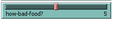
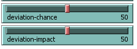
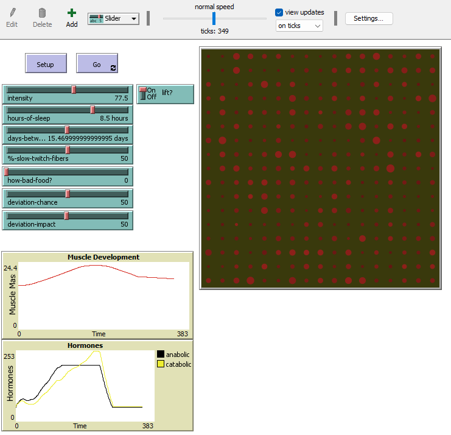
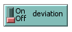
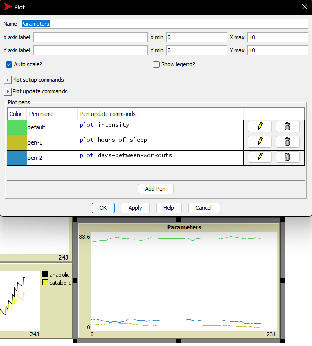
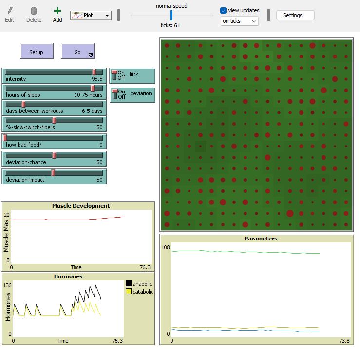
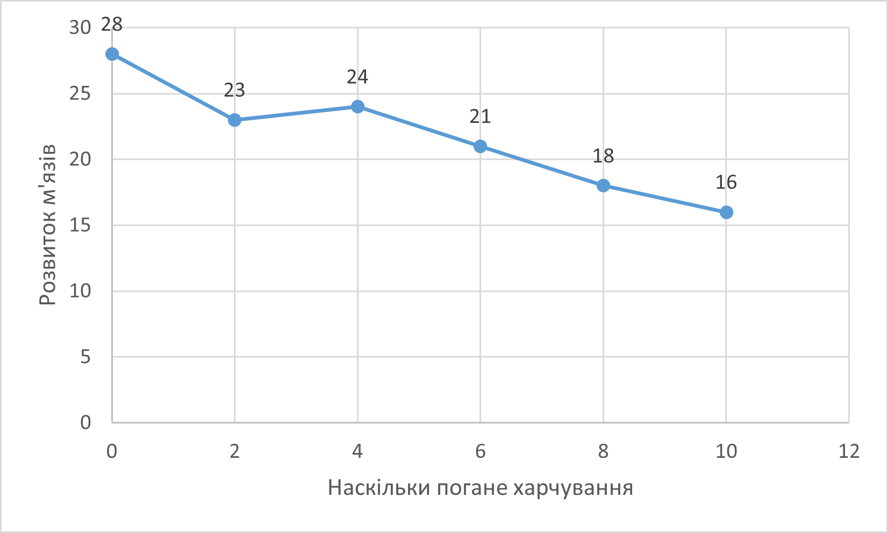

## Комп'ютерні системи імітаційного моделювання
## СПм-22-6, **Юрченко Тарас Андрійович**
### Лабораторна робота №**2**. Редагування імітаційних моделей у середовищі NetLogo

 

### Варіант 12, модель у середовищі NetLogo:
[Muscle Development](http://www.netlogoweb.org/launch#http://www.netlogoweb.org/assets/modelslib/Sample%20Models/Biology/Muscle%20Development.nlogo)  
Додати у моделі вплив харчування (умовний регулюємий параметр, наприклад, "якість харчування") на можливість зростання м'язової маси. Додати регулюємі користувачем параметри, що визначають вірогідність та міру тимчасового відхилення від вказаних початкових значень інтенсивності тренувань, кількості годин сну та днів між тренуваннями.

 

### Внесені зміни у вихідну логіку моделі, за варіантом:
Створив нову процедуру, аналогічну до **perform-daily-activity**, але з впливом, що залежить від якості харчування:
<pre>
to good-food
  ;; simulate hormonal effect of healthy food
  ask patches [
    set catabolic-hormone catabolic-hormone - 0.6 * (log catabolic-hormone 10) * (how-bad-food? / 10)
    set anabolic-hormone anabolic-hormone - 0.7 * (log anabolic-hormone 10) * (how-bad-food? / 10)
  ]
end
</pre>
Використана нова змінна, що задається користувачем (завдання за варіантом), **how-bad-food?**:  

Та ініціалізував використання **good-food** у процедурі **to go**.

Для додання логіки такої зміни за варіантом:
*Додати регулюємі користувачем параметри, що визначають вірогідність та міру тимчасового відхилення від вказаних початкових значень інтенсивності тренувань, кількості годин сну та днів між тренуваннями.*
додав два повзунки для налаштування ймовірності та впливу відхилення:  
  
Та розробив такі процедури:
<pre>
to set-intensity
  let random-number random 3
  if random-float 100 < deviation-chance [
  if random-number = 2 [
    set intensity (intensity + 1 * deviation-impact / 100)
  ]
  if random-number = 1 [
   set intensity (intensity - 1 * deviation-impact / 100)
  ]
  ]  
  if intensity < 50 [set intensity 50]
  if intensity > 100 [set intensity 100]
end
</pre>
<pre>
to set-hours-of-sleep
  let random-number random 2
  if random-float 100 < deviation-chance [
  if random-number = 0 [
    set hours-of-sleep (hours-of-sleep + 0.5 * deviation-impact / 100)
  ]
  if random-number = 1 [
   set hours-of-sleep (hours-of-sleep - 0.5 * deviation-impact / 100)
  ]
  ]  
  if hours-of-sleep < 0 [set hours-of-sleep 0]
  if hours-of-sleep > 12 [set hours-of-sleep 12]
end
</pre>
<pre>
to set-days-between-workouts
  let random-number random 3
  if random-float 100 < deviation-chance [
  if random-number = 2 [
    set days-between-workouts (days-between-workouts + 1 * deviation-impact / 100)
  ]
  if random-number = 1 [
   set days-between-workouts (days-between-workouts - 1 * deviation-impact / 100)
  ]
  ]  
  if days-between-workouts < 1 [set days-between-workouts 1]
  if days-between-workouts > 30 [set days-between-workouts 30]
end
</pre>
Та ініціалізував їх використання у процедурі **to go**.

Після зроблених змін модель виглядає наступним чином:  

 

### Внесені зміни у вихідну логіку моделі, на власний розсуд:
Додав можливість однією кнопкою відключити відхилення:  

<pre>
to go
  ...
if deviation = true [
  set-intensity
  set-hours-of-sleep
  set-days-between-workouts
  ]
  ...
end
</pre>
Додав графік для відображення змін параметрів **intensity**, **hours-of-sleep** та **days-between-workouts**:  

Після усіх змін модель у процесі симуляції виглядає наступним чином:  

 

## Обчислювальні експерименти
### 1. Дослідження залежності результатів від якості харчування:
Досліджується **Muscle Development** протягом певної кількості тактів (200) у залежності від **how-bad-food?**.
Керуючі параметри мають такі значення за замовчуванням:
- **intensity** 90
- **hours-of-sleep** 5
- **days-between-workouts** 5
- **%-slow-twitch-fibers** 50
- **deviation** false
*Параметр **deviation** був відключений через викривлення результатів.*

<table>
<thead>
<tr><th>Наскількі погане харчування</th><th>Розвиток м'язів</th></tr>
</thead>
<tbody>
<tr><td>0</td><td>28</td></tr>
<tr><td>2</td><td>23</td></tr>
<tr><td>4</td><td>24</td></tr>
<tr><td>6</td><td>21</td></tr>
<tr><td>8</td><td>18</td></tr>
<tr><td>10</td><td>16</td></tr>
</tbody>
</table>

Під час проведення експерименту було відмічено, що при інших значеннях параметрів **intensity**, **hours-of-sleep** та **days-between-workouts**, а саме якщо вони будуть нижче - за високих значеннях how-bad-food? результат був фатальний для об'єкту симуляції(смерть). А за зазначених значень параметрів навіть з поганою їжею за допомогою сумлінної праці над м'язами результат був добрим (для об'єкта симуляції).
