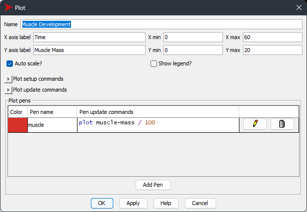
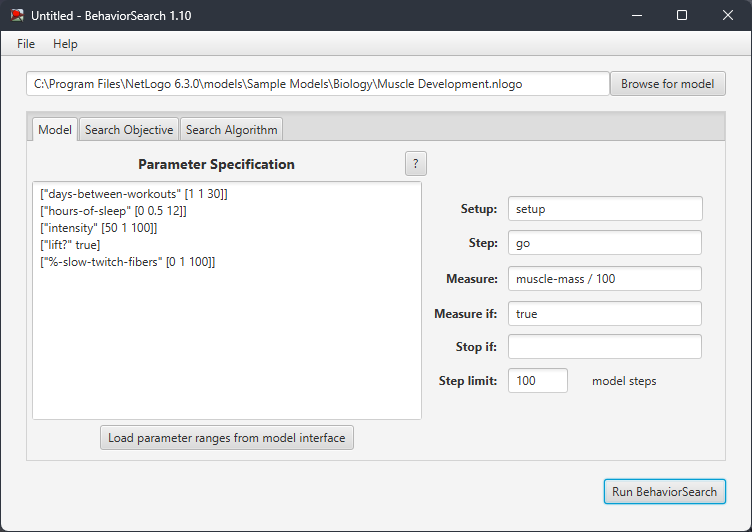
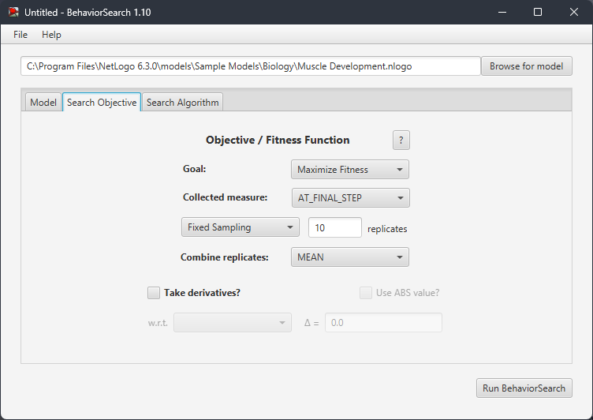
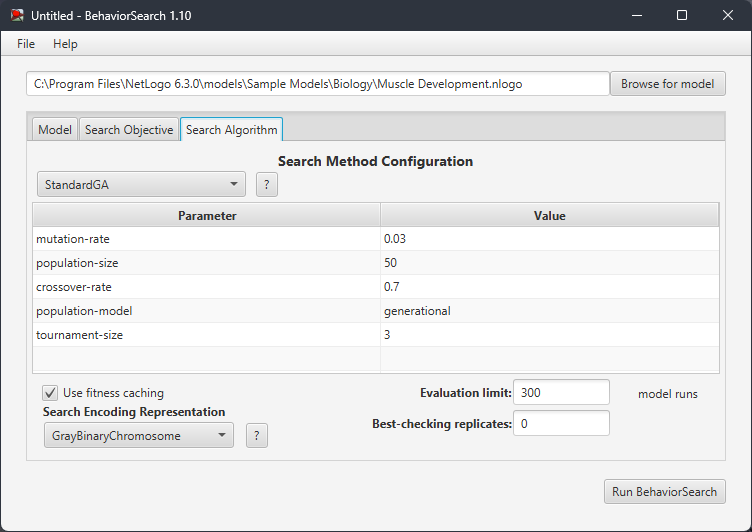
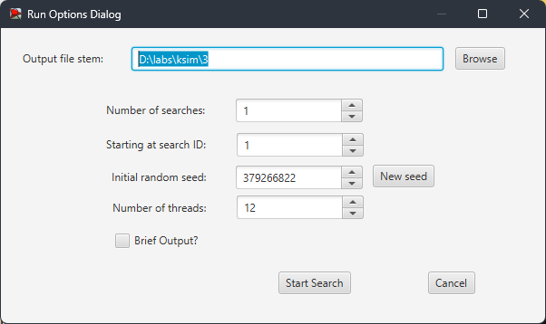
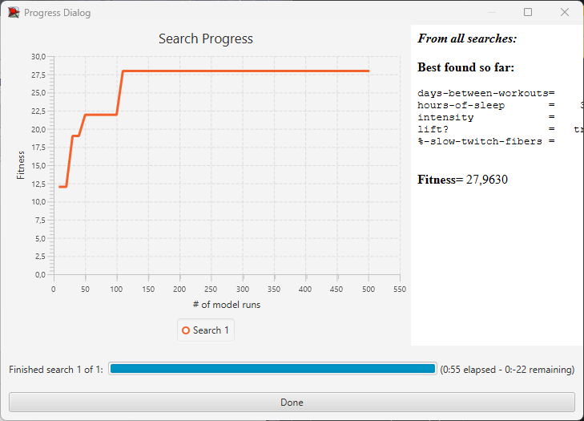
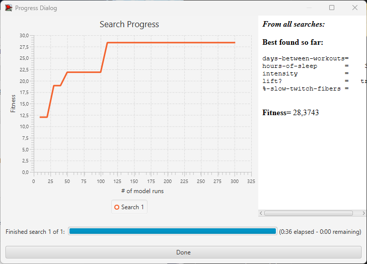

## Комп'ютерні системи імітаційного моделювання
## СПм-22-6, **Юрченко Тарас Андрійович**
### Лабораторна робота №**3**. Використання засобів обчислювального интелекту для оптимізації імітаційних моделей

 

### Варіант 12, модель у середовищі NetLogo:
[Muscle Development](http://www.netlogoweb.org/launch#http://www.netlogoweb.org/assets/modelslib/Sample%20Models/Biology/Muscle%20Development.nlogo)

 

### Вербальний опис моделі:
Це фізіологічна модель вправ. Він призначений для того, щоб допомогти вам зрозуміти фактори, що беруть участь у створенні відповідного гормонального балансу для розвитку м’язів під час підняття ваги. Ці фактори включають:

Частота: щоб побачити приріст м’язової маси, необхідно правильно контролювати частоту підняття тягарів. Якщо ви будете піднімати надто часто, у вас не буде часу на відновлення, а потім і на відновлення сильніших м’язів. Якщо вам не вдається підніматися досить часто, не буде достатньо стимулів, щоб викликати довгострокове збільшення м’язів.

Сон: організм більшу частину часу відновлюється під час сну. Якщо ви не висипаєтеся, у вас не буде достатньо можливостей для відновлення, тому вам буде важко наростити м’язи.

Інтенсивність: від того, наскільки наполегливо ви працюєте у тренажерному залі, залежить, наскільки ефективно ви залучаєте всі свої м’язові волокна. Чим більша кількість залучених волокон, тим сильніший стимул зростання, припускаючи, що забезпечується відповідне відновлення.

Генетика: Співвідношення між повільними та швидкими м’язовими волокнами відіграє велику роль у тому, скільки м’язів здатна розвинути людина. Хтось із більшістю волокон, які демонструють характеристики повільного скорочення, матиме високу витривалість, але потенціал для розвитку лише помірної м’язової маси. Людина з більшістю волокон із характеристиками швидкого скорочення матиме потенціал для розвитку значної м’язової маси, але низької витривалості.

Дієта: погана дієта може перешкоджати росту м’язів. У цій моделі ми припускаємо ідеальну дієту.

Усі п’ять цих факторів необхідно розуміти та збалансувати один з одним, щоб досягти оптимального розвитку м’язів. Відповідна комбінація сильно залежить від людини та її поточного унікального стану. З часом це зміниться.

### Керуючі параметри:
- **intensity** - Як важко працює атлет. Чим більша інтенсивність, тим більша кількість м’язових волокон буде втомлюватися під час кожного тренування.
- **hours-of-sleep** - Кількість сну людини впливає на те, наскільки швидко організм розщеплює гормони.
- **days-between-workouts** - Частота тренувань впливає на те, скільки часу має тіло на відновлення, а потім надмірна компенсація від останнього тренування.
- **%-slow-twitch-fibers** - Наскільки ймовірно, що кожне волокно має характеристики повільного скорочення.
- **lift?** - Вирішує, чи активно людина піднімає тяжкості.

### Внутрішні параметри:
<pre>
muscle-mass  ;; зберігає суму розмірів м'язових волокон
  ;; гормональні змінні, щоб забезпечити реалістичне середовище:
  anabolic-hormone-max
  anabolic-hormone-min
  catabolic-hormone-max
  catabolic-hormone-min
hormone-diffuse-rate  ;; швидкість, з якою гормони поширюються з одного волокна в інші
</pre>

### Показники роботи системи:
- **Muscle Development** - Сума розмірів усіх волокон за певний час.
- **Hormones** - Середній вміст гормону в кожному волокні.

 

### Налаштування середовища BehaviorSearch:

**Обрана модель**:
<pre>
C:\Program Files\NetLogo 6.3.0\models\Sample Models\Biology\Muscle Development.nlogo
</pre>
**Параметри моделі** (вкладка Model):  
<pre>
["days-between-workouts" [1 1 30]]
["hours-of-sleep" [0 0.5 12]]
["intensity" [50 1 100]]
["lift?" true]
["%-slow-twitch-fibers" [0 1 100]]
</pre>
Використовувана **міра**:  
Для фітнес-функції *(вона ж функція пристосованості або цільова функція)* було обрано **значення успішності розвитку м'язів**, вираз для її розрахунку взято з налаштувань графіка аналізованої імітаційної моделі в середовищі NetLogo  
  
та вказано у параметрі "**Measure**":
<pre>
muscle-mass / 100
</pre>
Значення успішності розвитку м'язів повинно враховуватися **в кінці** симуляції тривалістю 100 тактів, починаючи з 0 такту симуляції.  
*Параметр "**Mesure if**" зі значення true, по суті, і означає, що враховуватимуться всі такти симуляції, а чи не частина їх. Іноді має сенс не враховувати деякі такти через хаос в деяких моделях на початку їх використання. Наприклад, це показано в прикладі з документації BehaviorSearch.  
Параметри "**Setup**" та "**Go**" вказують відповідні процедури ініціалізації та запуску в логіці моделі (зазвичай вони так і називаються). BehaviorSearch в процесі роботи, по суті, замість користувача запускає ці процедури.*  
Параметр зупинки за умовою ("**Stop if**") у разі не використовувався.  
Загальний вигляд вкладки налаштувань параметрів моделі:  

**Налаштування цільової функції** (вкладка Search Objective):  
Метою підбору параметрів імітаційної моделі, є **максимізація** значення – це вказано через параметр "**Goal**" зі значенням **Maximize Fitness**. При цьому цікавить саме кінцеве її значення. Для цього у параметрі "**Collected measure**", що визначає спосіб обліку значень обраного показника, вказано **AT_FINAL_STEP**.  
Щоб уникнути викривлення результатів через випадкові значення, що використовуються в логіці самої імітаційної моделі, **кожна симуляція повторюється по 10 разів**, результуюче значення розраховується як **середнє арифметичне**.  
Загальний вигляд вкладки налаштувань цільової функції:  

**Налаштування алгоритму пошуку** (вкладка Search Algorithm):  
Загальний вид вкладки налаштувань алгоритму пошуку:  

 

### Результати використання BehaviorSearch:
Діалогове вікно запуску пошуку *(можна залишити за замовчуванням, але стежте, куди пишеться результат)*:  

Результат пошуку параметрів імітаційної моделі, використовуючи **генетичний алгоритм**:  

Результат пошуку параметрів імітаційної моделі, використовуючи **випадковий пошук**:  

